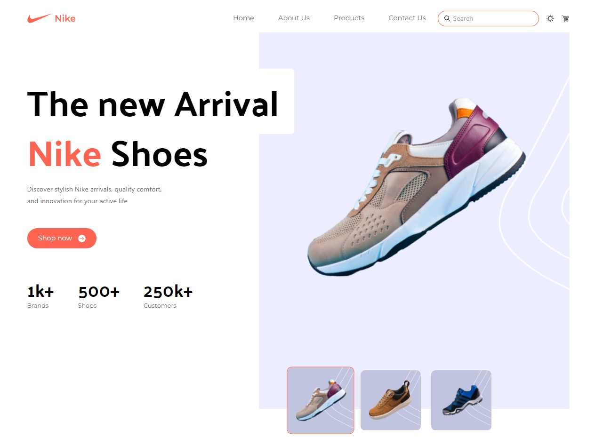
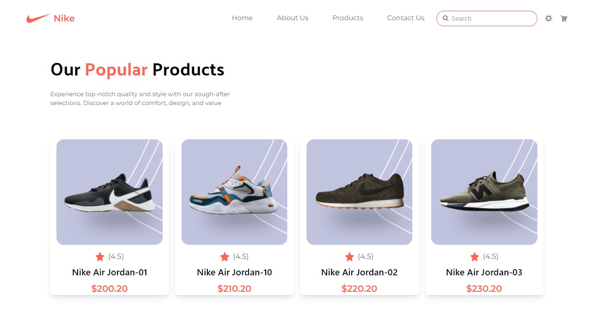
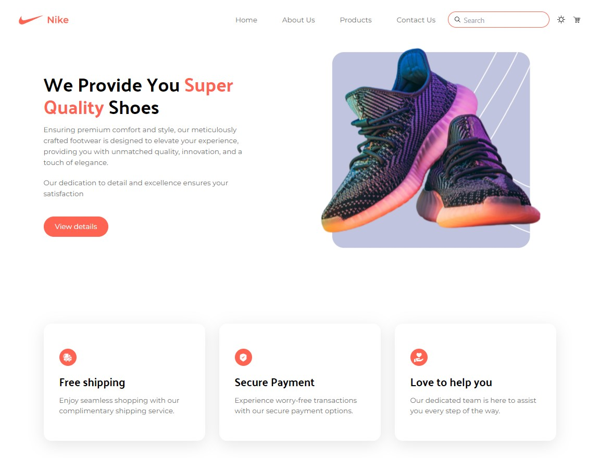
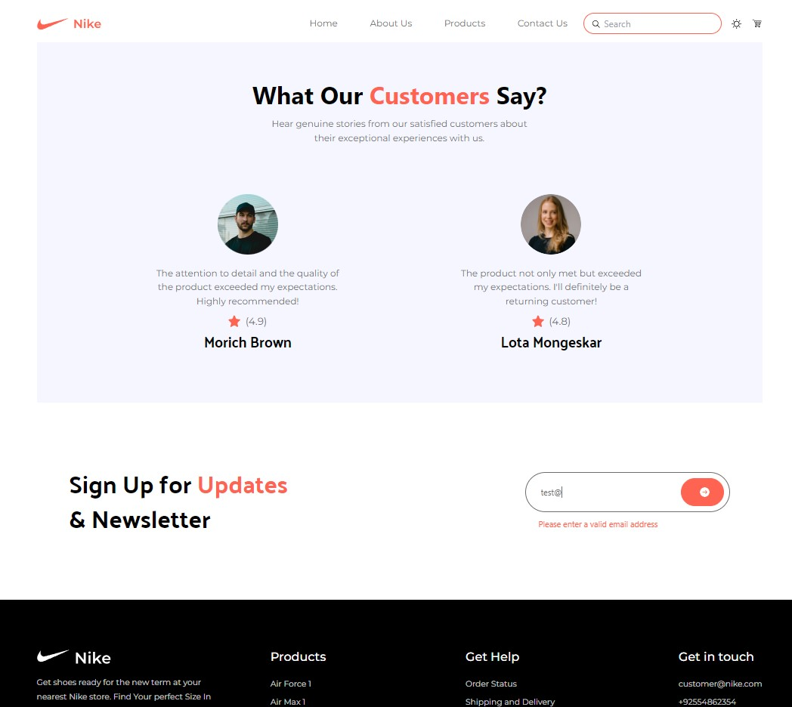
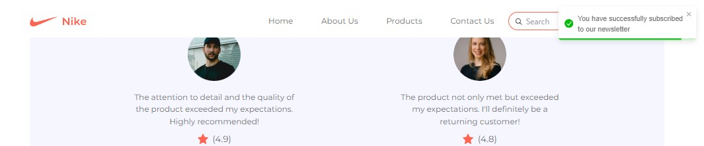
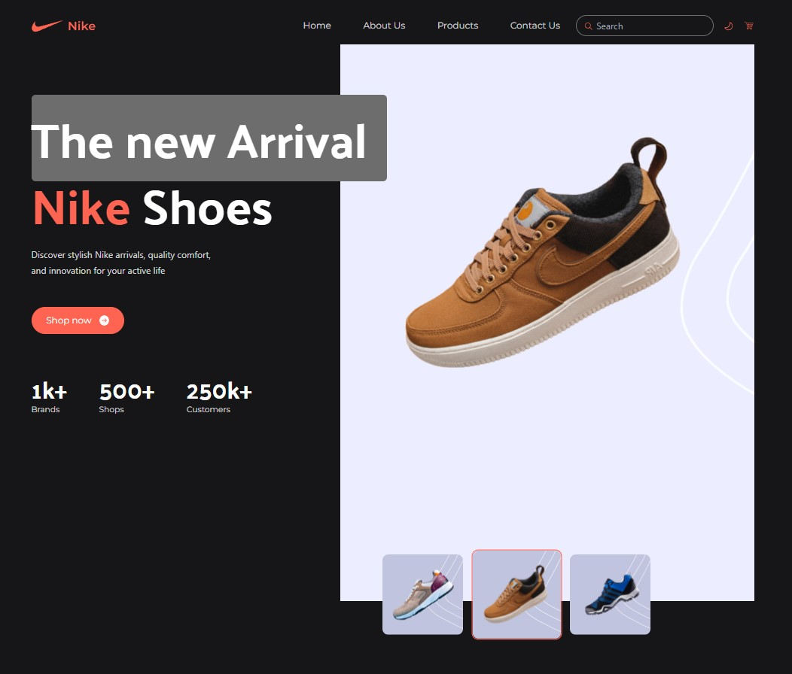
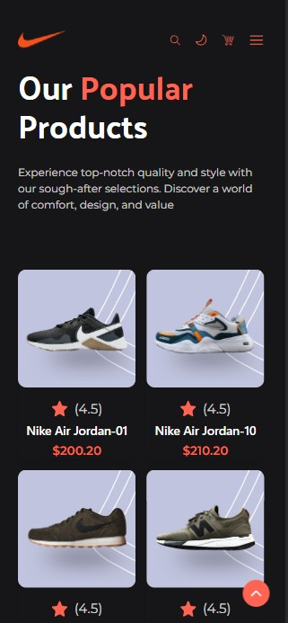

# Nike landing page

This project is a responsive landing page for Nike shop to practice Tailwind.
The primary focus of the project was to gain hands-on experience with Tailwind, and as such, functional elements like buttons, the cart icon, and the search form have not been implemented. However, the landing page showcases several working features, including a dark mode toggle, a subscription form for the newsletter, live email validation, and notifications upon successful subscription.

## Table of Contents
- [Links](#links)
- [Technologies](#technologies)
- [Screenshots](#screenshots)
- [Functionality](#functionality)
- [Installation](#installation)

## Links

Deploy: [https://nike-tailwind-clone.vercel.app/](https://nike-tailwind-clone.vercel.app/)

## Technologies

* Tailwind CSS
* React JS (Functional components, hooks, context)
* HTML

## Screenshots

<b>Hero section</b>

<b>Show all</b>

<b>Popular products section</b>

<b>Quality and Services sections</b>

<b>Reviews and Subscription sections</b>

<b>Notification on successful subscription</b>

<b>Dark theme</b>

<b>Mobile version</b>

## Functionality

1. **Theme Selection:**

* Users can easily switch between light and dark themes to customize their browsing experience.
* Theme preferences are saved locally using localStorage for a consistent experience across sessions.

2. **Subscription Form:**

* The landing page includes a subscription form allowing users to sign up for updates and newsletters.

3. **Live Validation:**

* Real-time validation ensures that users provide a valid email address before submitting the form.
* Users receive immediate feedback on their input, with error messages displayed if the email is invalid.

4. **Notification on Successful Subscription:**

* Upon successful subscription, users receive a notification to confirm their sign-up.
* Toast notifications provide a non-intrusive way to communicate subscription status.

5. **Dynamic UI Components:**

* UI components, such as buttons and input fields, adapt dynamically based on user interactions and theme preferences.
* Interactive elements provide an engaging and user-friendly experience.

6. **Responsive Design:**

* The landing page is designed to be responsive, ensuring a seamless and visually appealing experience across various screen sizes and devices.

## Installation

Clone repository:

  `git clone https://github.com/IrinaGarmaeva/nike_landing_page`

Install dependencies:

  `npm install`

Run app:

  `npm run start`

Build app(production):

  `npm run build`

